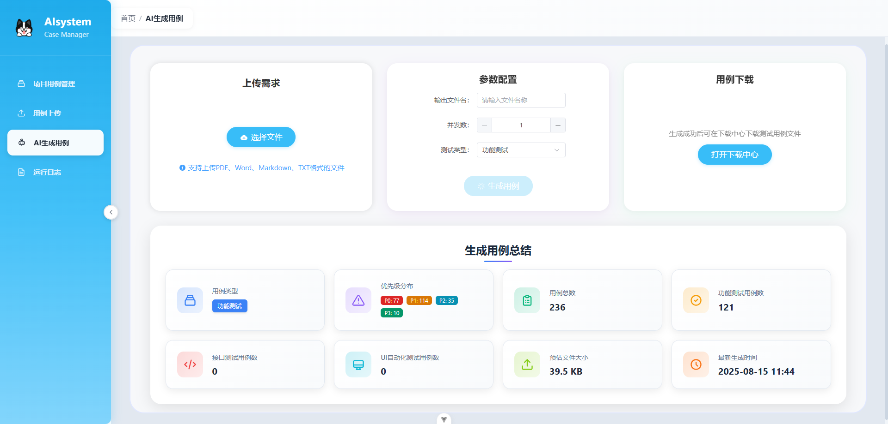
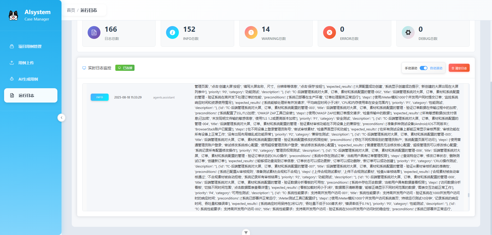
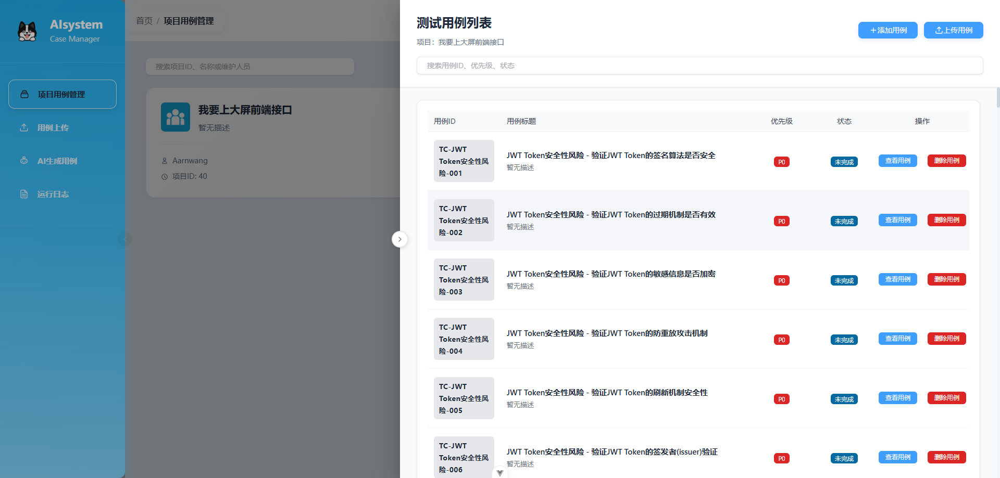

# 测试用例管理系统

一个基于 Flask + Vue 3 的现代化测试用例管理系统，支持Excel文件批量上传、项目管理、用例查看、AI智能生成等功能。

## 项目特性
### 项目截图





### 推荐先使用 QWEN_MODEL = 'qwen-plus-latest' 模型，其他模型开发完了在适配

### 核心功能
- 项目管理: 创建、编辑、删除项目，支持项目描述和维护人员管理
- Excel批量上传: 支持 `.xlsx` 格式文件上传，智能解析Excel内容
- 重复检测: 自动检测文件内重复和数据库中已存在的用例
- 智能导入: 支持选择性导入，可为重复用例指定新ID
- 用例查看: 按项目查看关联的测试用例，支持详细用例信息展示
- **AI测试用例生成**: 基于文档的智能测试用例生成，支持多种测试类型
- 响应式界面: 现代化的UI设计，支持侧边栏导航

### 技术特性
- 前后端分离: Flask RESTful API + Vue 3 SPA
- 数据库支持: MySQL数据库，支持复杂查询和关联
- 文件处理: 支持Excel文件解析和验证
- **AI集成**: 集成AutoGen框架和OpenAI模型，支持智能测试用例生成
- **文档解析**: 支持Word、PDF、Markdown等多种文档格式
- 错误处理: 完善的异常处理和用户友好的错误提示
- 组件通信: 基于事件的组件间通信机制

## 技术栈

### 后端
- Python 3.8+
- Flask: Web框架
- Flask-CORS: 跨域支持
- Flask-MySQLdb: MySQL数据库连接
- openpyxl: Excel文件处理
- Werkzeug: 文件上传处理
- **AutoGen: AI代理框架**
- **OpenAI: AI模型集成**
- **Browser-use: Web自动化**
- **Playwright: 浏览器自动化**
- **文档处理: python-docx, PyPDF2, markdown**

### 前端
- Vue 3: 渐进式JavaScript框架
- Vue Router: 路由管理
- Element Plus: UI组件库
- Axios: HTTP客户端
- Vite: 构建工具

### 数据库
- MySQL 5.7+: 关系型数据库

## 环境要求

### 系统要求
- Python 3.8 或更高版本
- Node.js 20.19+ 或 22.12+
- MySQL 5.7 或更高版本
- Git

### Python依赖
项目使用以下关键Python包：
- **Web框架**: Flask, Flask-CORS, Flask-MySQLdb
- **AI与自动化**: autogen, openai, browser_use, playwright
- **文档处理**: python-docx, PyPDF2, markdown, pandas, openpyxl
- **开发工具**: pytest, black, isort, flake8
- **工具库**: python-dotenv, pydantic, asyncio, tenacity

### Node.js依赖
前端使用以下关键包：
- **框架**: Vue 3, Vue Router
- **UI库**: Element Plus
- **构建工具**: Vite
- **HTTP客户端**: Axios

## 项目结构

```
JoinTestCase/
├── backend/                 # 后端代码
│   ├── app.py              # Flask应用主文件
│   ├── models/             # 数据模型
│   │   ├── __init__.py
│   │   └── db.py          # 数据库连接
│   ├── routes/             # 路由模块
│   │   ├── __init__.py
│   │   ├── project.py     # 项目管理路由
│   │   ├── test_case.py   # 测试用例路由
│   │   ├── upload.py      # 文件上传路由
│   │   └── ai_generate.py # AI测试用例生成路由
│   ├── ai_test_cases/      # AI测试系统
│   │   ├── src/           # AI系统源代码
│   │   │   ├── agents/    # AI代理
│   │   │   ├── services/  # AI服务
│   │   │   ├── templates/ # 测试用例模板
│   │   │   └── utils/     # AI工具
│   │   ├── docs/          # 文档存储
│   │   └── requirements.txt # AI系统依赖
│   └── uploads/           # 上传文件存储目录
├── frontend/              # 前端代码
│   ├── src/
│   │   ├── api/           # API接口
│   │   │   └── case.js    # 测试用例相关API
│   │   ├── assets/        # 静态资源
│   │   ├── components/    # Vue组件
│   │   ├── views/         # 页面组件
│   │   │   ├── ManageCase.vue    # 项目管理页面
│   │   │   ├── UploadCase.vue    # 用例上传页面
│   │   │   └── AiGenerateCase.vue # AI测试用例生成页面
│   │   ├── App.vue        # 根组件
│   │   ├── main.js        # 应用入口
│   │   └── router.js      # 路由配置
│   ├── index.html         # HTML模板
│   ├── package.json       # 依赖配置
│   └── vite.config.js     # Vite配置
├── requirements.txt        # Python依赖（根目录）
├── config.py              # 数据库配置
├── db_init.sql           # 数据库初始化脚本
├── read_excel.py         # Excel读取工具
└── 登录测试用例.xlsx      # 示例Excel文件
```

## 数据库设计

### 核心表结构

#### projects 表 (项目表)
```sql
CREATE TABLE projects (
    id INT AUTO_INCREMENT PRIMARY KEY,
    name VARCHAR(255) NOT NULL,
    description TEXT,
    maintainers VARCHAR(255) DEFAULT ''
);
```

#### test_cases 表 (测试用例表)
```sql
CREATE TABLE test_cases (
    id INT AUTO_INCREMENT PRIMARY KEY,
    case_id VARCHAR(200) NOT NULL,
    title VARCHAR(255),
    description TEXT,
    preconditions TEXT,
    steps TEXT,
    expected_results TEXT,
    priority VARCHAR(50),
    category VARCHAR(100),
    status VARCHAR(50),
    created_at DATETIME,
    updated_at DATETIME,
    created_by VARCHAR(100),
    last_updated_by VARCHAR(100),
    project_id INT,
    FOREIGN KEY (project_id) REFERENCES projects(id)
);

-- 添加项目内唯一约束，确保同一项目内case_id唯一
ALTER TABLE test_cases ADD UNIQUE INDEX unique_case_id_per_project (project_id, case_id);
```

#### project_cases 表 (项目用例关联表)
```sql
CREATE TABLE project_cases (
    id INT AUTO_INCREMENT PRIMARY KEY,
    project_id INT,
    test_case_id INT,
    FOREIGN KEY (project_id) REFERENCES projects(id),
    FOREIGN KEY (test_case_id) REFERENCES test_cases(id)
);
```

#### ai_test_generation_history 表 (AI测试用例生成历史表)
```sql
CREATE TABLE `ai_test_generation_history` (
  `id` int(11) NOT NULL AUTO_INCREMENT,
  `case_types` json DEFAULT NULL,
  `priority_distribution` json DEFAULT NULL,
  `total_cases` int(11) DEFAULT '0',
  `functional_test_count` int(11) DEFAULT '0',
  `api_test_count` int(11) DEFAULT '0',
  `ui_auto_test_count` int(11) DEFAULT '0',
  `estimated_file_size` bigint(20) DEFAULT NULL,
  `generated_at` datetime DEFAULT NULL,
  `filename` varchar(255) COLLATE utf8mb4_unicode_ci DEFAULT NULL,
  `created_at` timestamp NULL DEFAULT CURRENT_TIMESTAMP,
  `updated_at` timestamp NULL DEFAULT CURRENT_TIMESTAMP ON UPDATE CURRENT_TIMESTAMP,
  PRIMARY KEY (`id`),
  KEY `idx_generated_at` (`generated_at`),
  KEY `idx_filename` (`filename`)
) ENGINE=InnoDB AUTO_INCREMENT=9 DEFAULT CHARSET=utf8mb4 COLLATE=utf8mb4_unicode_ci;
```

## 快速开始

### 环境要求
- Python 3.8+
- Node.js 20.19.0+
- MySQL 5.7+

### 1. 克隆项目
```bash
git clone <repository-url>
cd JoinTestCase
```

### 2. 后端设置

#### 安装Python依赖
```bash
# 从requirements.txt安装所有Python依赖
pip install -r requirements.txt

# 或手动安装核心依赖
pip install flask flask-cors flask-mysqldb openpyxl werkzeug python-dotenv autogen openai asyncio pydantic fastapi uvicorn browser_use playwright python-docx PyPDF2 markdown pandas python-multipart aiofiles typing tenacity numpy matplotlib pytest pytest-asyncio pytest-cov black isort flake8
```

#### 配置数据库
1. 创建MySQL数据库
```sql
CREATE DATABASE testcase_manager CHARACTER SET utf8mb4 COLLATE utf8mb4_unicode_ci;
```

2. 修改 `config.py` 中的数据库配置
```python
class Config:
    MYSQL_HOST = 'localhost'
    MYSQL_PORT = 3306
    MYSQL_USER = 'your_username'
    MYSQL_PASSWORD = 'your_password'
    MYSQL_DB = 'testcase_manager'
    MYSQL_CURSORCLASS = 'DictCursor'
```

3. 初始化数据库
```bash
mysql -u your_username -p testcase_manager < db_init.sql
```

#### 启动后端服务
```bash
cd backend
python app.py
```
后端服务将在 `http://localhost:5000` 启动

### 3. 前端设置

#### 安装Node.js依赖
```bash
cd frontend
npm install
```

### 4. AI接口配置
1. 进入AI系统目录
```bash
cd backend/ai_test_cases
```

2. 创建环境配置文件
```bash
# 创建.env文件
touch .env
```

3. 配置AI接口参数
```bash
# 编辑.env文件，添加以下配置
QWEN_BASE_URL='https://your-ai-api-endpoint.com/v1'
QWEN_API_KEY='your-api-key-here'
QWEN_MODEL='qwen-turbo'  # 或其他支持的模型名称

# 如果使用OpenAI，可以配置
OPENAI_API_KEY='your-openai-api-key'
OPENAI_BASE_URL='https://api.openai.com/v1'
```

4. 安装AI系统依赖
```bash
pip install -r requirements.txt
```

#### 启动开发服务器
```bash
npm run dev
```
前端应用将在 `http://localhost:5173` 启动

## 使用说明

### 项目管理
1. **创建项目**: 点击"创建项目"按钮，填写项目名称、描述和维护人员
2. **编辑项目**: 点击项目列表中的"编辑"按钮修改项目信息
3. **删除项目**: 点击"删除"按钮，确认后删除项目（同时删除关联的测试用例）

### 测试用例上传
1. **选择项目**: 在用例上传页面选择要导入用例的项目
2. **上传文件**: 点击"选择文件"按钮，选择 `.xlsx` 格式的Excel文件
3. **预览数据**: 系统会自动解析Excel内容并显示预览
4. **处理重复**: 
   - 系统会自动检测重复的用例ID
   - 重复的用例会以红色背景高亮显示
   - 可以为重复用例指定新的ID
5. **选择导入**: 勾选要导入的用例，点击"导入选中用例"

### 用例查看
1. **查看项目用例**: 在项目管理页面点击"查看用例"按钮
2. **查看用例详情**: 在用例列表中点击"查看"按钮查看完整用例信息

### AI测试用例生成
1. **上传文档**: 在AI生成页面上传需求文档（支持Word、PDF、Markdown等格式）
2. **配置参数**: 
   - 选择测试类型（功能测试、接口测试、UI自动化测试）
   - 设置并发数（1-5）
   - 指定输出文件名
3. **开始生成**: 点击"开始生成"按钮，系统将自动分析文档并生成测试用例
4. **监控进度**: 系统会显示生成进度和状态
5. **查看结果**: 生成完成后可在下载中心查看和下载生成的测试用例文件

## API接口

### 项目管理
- `GET /project` - 获取所有项目
- `POST /project` - 创建新项目
- `PUT /project/{id}` - 更新项目
- `DELETE /project/{id}` - 删除项目
- `GET /project/{id}/testcases` - 获取项目关联的测试用例

### 文件上传
- `POST /upload_case` - 上传Excel文件并解析
- `POST /import_case` - 导入选中的测试用例

### AI测试用例生成
- `POST /ai_generate/upload` - 上传需求文档
- `POST /ai_generate/generate` - 生成测试用例
- `GET /ai_generate/files` - 获取生成的文件列表
- `GET /ai_generate/download/{filename}` - 下载生成的测试用例文件
- `GET /ai_generate/summary` - 获取生成结果摘要
- `GET /ai_generate/latest_summary` - 获取最新生成摘要

## 界面特性

### 设计风格
- **现代化UI**: 基于Element Plus的现代化界面设计
- **响应式布局**: 适配不同屏幕尺寸
- **侧边栏导航**: 清晰的导航结构
- **卡片式布局**: 信息层次分明

### 交互体验
- **智能表格**: 自适应列宽，支持排序和筛选
- **弹窗操作**: 模态框形式的增删改操作
- **实时反馈**: 操作结果即时反馈
- **错误提示**: 友好的错误信息展示
- **进度显示**: AI生成过程的实时进度展示

## 功能详解

### Excel文件处理
- **格式支持**: 仅支持 `.xlsx` 格式
- **列名映射**: 自动识别Excel表头并映射到数据库字段
- **数据清洗**: 自动处理空值和特殊字符
- **重复检测**: 智能检测文件内和数据库中的重复数据

### AI测试用例生成
- **文档解析**: 支持多种文档格式的智能解析
- **用例类型**: 支持功能测试、接口测试、UI自动化测试三种类型
- **智能分析**: 基于AI模型的需求分析和用例设计
- **批量生成**: 支持批量生成大量测试用例
- **质量保证**: 生成的用例包含完整的测试步骤和预期结果

### 数据验证
- **文件格式验证**: 确保上传文件为有效格式
- **数据完整性**: 验证必要字段的存在性
- **ID唯一性**: 确保测试用例ID的唯一性

### 错误处理
- **文件上传错误**: 处理文件格式错误和上传失败
- **数据库错误**: 处理数据库连接和操作异常
- **网络错误**: 处理API请求超时和网络异常
- **AI生成错误**: 处理AI模型调用失败和生成异常

## 故障排除

### 常见问题

#### 1. AI生成失败
**问题**: AI测试用例生成过程中出现错误
**解决方案**:
- 检查AI接口配置是否正确
- 确认API密钥是否有效
- 检查网络连接是否稳定
- 查看后端日志获取详细错误信息

#### 2. 数据库连接失败
**问题**: 无法连接到MySQL数据库
**解决方案**:
- 检查数据库服务是否启动
- 确认数据库连接参数是否正确
- 检查防火墙设置
- 验证数据库用户权限

#### 3. 前端代理错误
**问题**: 出现ECONNRESET等代理错误
**解决方案**:
- 重启前端和后端服务
- 检查端口是否被占用
- 确认Vite代理配置是否正确
- 检查网络连接稳定性

#### 4. 文件上传失败
**问题**: 文件上传过程中出现错误
**解决方案**:
- 检查文件格式是否支持
- 确认文件大小是否超限
- 检查上传目录权限
- 验证文件内容是否完整

### 日志查看
- **后端日志**: 查看控制台输出的错误信息
- **前端日志**: 查看浏览器控制台的错误信息
- **数据库日志**: 查看MySQL错误日志

## 部署说明

### 生产环境部署
1. **后端部署**: 使用Gunicorn或uWSGI部署Flask应用
2. **前端构建**: 运行 `npm run build` 构建生产版本
3. **静态文件服务**: 使用Nginx服务前端静态文件
4. **数据库优化**: 配置MySQL性能参数和索引

### 环境变量配置
```bash
# 数据库配置
MYSQL_HOST=localhost
MYSQL_PORT=3306
MYSQL_USER=your_username
MYSQL_PASSWORD=your_password
MYSQL_DB=testcase_manager

# Flask配置
FLASK_ENV=production
FLASK_SECRET_KEY=your_secret_key

# AI接口配置
QWEN_BASE_URL=https://your-ai-api-endpoint.com/v1
QWEN_API_KEY=your-api-key
QWEN_MODEL=qwen-turbo
```

### 性能优化
1. **数据库优化**: 添加适当的索引，优化查询语句
2. **缓存策略**: 使用Redis缓存频繁访问的数据
3. **负载均衡**: 使用Nginx进行负载均衡
4. **监控告警**: 配置系统监控和告警机制

## 贡献指南

1. Fork 项目
2. 创建功能分支 (`git checkout -b feature/AmazingFeature`)
3. 提交更改 (`git commit -m 'Add some AmazingFeature'`)
4. 推送到分支 (`git push origin feature/AmazingFeature`)
5. 打开 Pull Request

## 更新日志
### V1.0.4 (2025-08-29)
- ✅ 增加AI生成用例策略组json识别
- ✅ 增加用例需求分析功能点规则匹配度
- ✅ 补充用例上传的部分识别逻辑
- ✅ 增加系统设置，后续所有的模型配置将不在代码中写死，改为配置
- ✅ 解决AutoAgent框架识别部分模型时，无法计算价格导致的warning

### V1.0.3 (2025-08-22)
- ✅ 手动增加测试用例功能
- ✅ 运行日志

### V1.0.2 (2025-08-12)
- ✅ 优化AI生成用例的用户体验
- ✅ 修复文件选择后清除生成总结的问题
- ✅ 修复用例类型显示问题
- ✅ 优化下载中心弹窗标题样式
- ✅ 改进错误处理和用户提示

### V1.0.1 (2025-08-10)
- ✅ AI生成能力（已开发完成）接入用例平台
- ✅ 生成用例总结数据实时显示
- ✅ 支持多种测试类型（功能测试、接口测试、UI自动化测试）
- ✅ 智能文档解析和用例生成
- ✅ 生成历史记录和统计

### v1.0.0 (2025-08-01)
- ✅ 基础项目管理功能
- ✅ Excel文件上传和解析
- ✅ 测试用例批量导入
- ✅ 重复数据检测和处理
- ✅ 响应式Web界面

## 许可证

本项目采用 MIT 许可证 - 查看 [LICENSE](LICENSE) 文件了解详情

## 联系方式

如有问题或建议，请通过以下方式联系：
- 项目Issues: [GitHub Issues](https://github.com/AarnWang/testcase-manager/issues)
- 邮箱: maz9366@163.com

---

**注意**: 请确保在生产环境中修改默认的数据库密码和其他敏感配置信息。